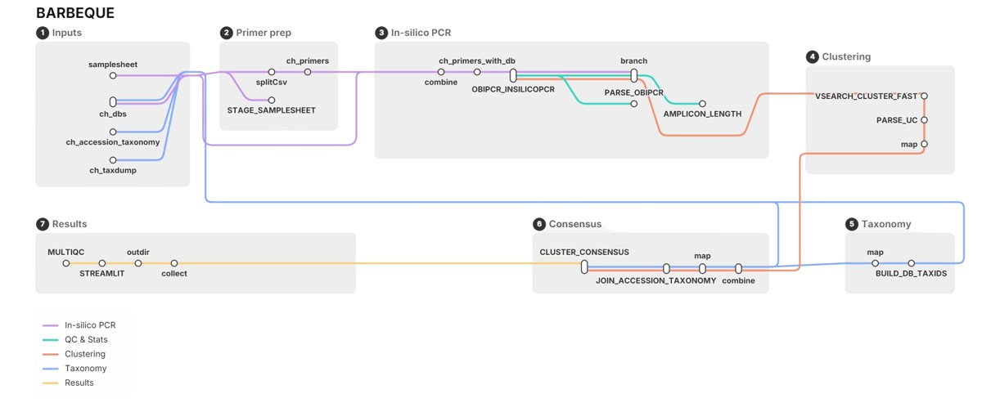

# BarBeQuE

BarBeQuE (BARcode BEnchmarking and QUality Evaluation) is a Nextflow DSL2 pipeline for benchmarking metabarcoding primer systems against reference databases.

It predicts in-silico amplicons, clusters identical or near-identical barcode sequences, assigns consensus taxonomy, and reports whether a primer/database combination is likely to resolve the taxa you care about.



[](https://www.nextflow.io/)
[](https://docs.conda.io/en/latest/)
[](https://www.docker.com/)
[](https://sylabs.io/docs/)
[](https://apptainer.org/)

## What It Does

BarBeQuE has two entry points:

- Normal benchmarking: primers x databases -> in-silico PCR -> clustering -> consensus taxonomy -> reports.
- `--build_references`: install reference FASTAs, primer FASTAs, NCBI taxdump, and accession-to-taxid data.

## Quick Start

This branch is not yet merged into bio-raum/BarBeQuE, so clone it from the fork:

```bash
git clone -b feature/multiqc-taxon-cluster-search https://github.com/jissksaji/BarBeQuE.git
cd BarBeQuE
```

Install the references once on a fresh system:

```bash
nextflow run main.nf \
  -profile conda \
  --build_references \
  --reference_base /path/to/references
```

Then benchmark your primers against your own database:

```bash
nextflow run main.nf \
  -profile conda \
  --input primers.tsv \
  --custom_db /path/to/database.fasta \
  --reference_base /path/to/references \
  --outdir results
```

## Documentation

1. [Installation](docs/installation.md)
2. [Usage](docs/usage.md)
3. [Primer Input](docs/primer_input.md)
4. [Pipeline Workflow](docs/pipeline.md)
5. [Main Analysis Workflow](docs/barbeque.md)
6. [Reference Installation](docs/build_references.md)
7. [Outputs](docs/output.md)
8. [Software](docs/software.md)
9. [Troubleshooting](docs/troubleshooting.md)
10. [Developer Guide](docs/developer.md)
11. [Versioning](docs/versioning.md)
